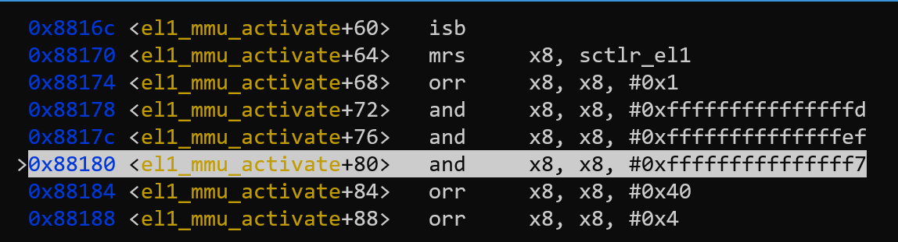
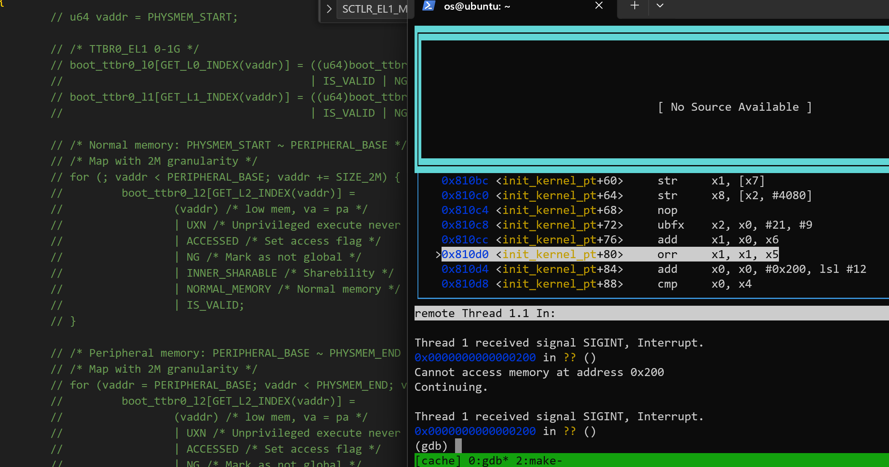

# lab1

> 思考题 1：阅读 `_start` 函数的开头，尝试说明 ChCore 是如何让其中一个核首先进入初始化流程，并让其他核暂停执行的。
>
> 提示：可以在 [Arm Architecture Reference Manual](https://documentation-service.arm.com/static/61fbe8f4fa8173727a1b734e) 找到 `mpidr_el1` 等系统寄存器的详细信息。

_start函数开头如下所示：

``` asm
BEGIN_FUNC(_start)
    mrs x8, mpidr_el1
    and x8, x8, #0xFF
    cbz x8, primary

    /* Wait for bss clear */
wait_for_bss_clear:
    adr x0, clear_bss_flag
    ldr x1, [x0]
    cmp     x1, #0
    bne wait_for_bss_clear
```

mpidr_el1 用于在 ARMv8-A 体系结构中处理多核处理器的多核调度和控制，它的最后八位表示 CPU 的本地标识符 (CPU Affinity)，是辨识CPU的标志。如果这八位为0，说明这个核是CPU的引导核心。`cbz x8, primary` 使得引导核心，也就是核1进入了primary函数。其它三个核进入`wait_for_bss_clear`, 这个函数是一个循环指令。bss如果没有clear，就会一直循环下去。从而实现让其中一个核首先进入初始化流程，并让其他核暂停执行的。

> 练习题 2：在 `arm64_elX_to_el1` 函数的 `LAB 1 TODO 1` 处填写一行汇编代码，获取 CPU 当前异常级别。
>
> 提示：通过 `CurrentEL` 系统寄存器可获得当前异常级别。通过 GDB 在指令级别单步调试可验证实现是否正确。

```asm
mrs x9, CURRENTEL
```

`mrs` 指令将CURRENTEL系统寄存器的值存入x9，选择x9是因为后面判断是用的是x9寄存器。

> 练习题 3：在 `arm64_elX_to_el1` 函数的 `LAB 1 TODO 2` 处填写大约 4 行汇编代码，设置从 EL3 跳转到 EL1 所需的 `elr_el3` 和 `spsr_el3` 寄存器值。具体地，我们需要在跳转到 EL1 时暂时屏蔽所有中断、并使用内核栈（`sp_el1` 寄存器指定的栈指针）。

``` asm
adr x9, .Ltarget
msr elr_el3, x9
mov x9, SPSR_ELX_DAIF | SPSR_ELX_EL1H
msr spsr_el3, x9
```

adr x9, .Ltarget: 将目的标签.Ltarget的地址存储在寄存器x9中。
msr elr_el3, x9: 将寄存器x9中的值写入到异常返回地址寄存器elr_el3中。
mov x9, SPSR_ELX_DAIF | SPSR_ELX_EL1H: 将SPSR_ELX_DAIF和SPSR_ELX_EL1H两个位域的值合并后，将结果存储在寄存器x9中，其中 SPSR_ELX_DAIF 用来设置屏蔽中断，而 SPSR_ELX_EL1H 用来设置内核栈。
msr spsr_el3, x9: 将寄存器x9中的值写入到当前模式下的程序状态寄存器spsr_el3中。

> 思考题 4：说明为什么要在进入 C 函数之前设置启动栈。如果不设置，会发生什么？

为什么需要在进入C函数之前设置启动栈：

1. 保存上下文：当程序执行一个函数调用时，需要将当前函数的状态保存在栈上，包括返回地址和局部变量。如果不设置，则可能导致函数上下文缺失，函数执行完成后无法正确地返回到调用函数。
2. 局部变量：函数中的局部变量通常存储在启动栈上。如果不设置，则可能导致局部变量冲突。
3. 传递参数：当函数参数过多（超过8个）时，需要使用启动栈来传递多余参数。如果不设置，多余的参数无法传递。

> 思考题 5：在实验 1 中，其实不调用 `clear_bss` 也不影响内核的执行，请思考不清理 `.bss` 段在之后的何种情况下会导致内核无法工作。

`.bss`存储未初始化的全局变量和静态变量。如果不清理 .bss 段，则这些变量的默认值将取决于该内存区域的先前内容。这可能会导致程序产生不可预测的结果，甚至崩溃。

> 练习题 6：在 `kernel/arch/aarch64/boot/raspi3/peripherals/uart.c` 中 `LAB 1 TODO 3` 处实现通过 UART 输出字符串的逻辑。

先调用`early_uart_init()`进行初始化，然后遍历字符串，使用`early_uart_send(str[i])`输出每个字符。

``` c
early_uart_init();
for (int i = 0; str[i] != '\0'; i++)
    early_uart_send(str[i]);
```

> 练习题 7：在 `kernel/arch/aarch64/boot/raspi3/init/tools.S` 中 `LAB 1 TODO 4` 处填写一行汇编代码，以启用 MMU。

``` asm
orr     x8, x8, #SCTLR_EL1_M
```

将立即数#SCTLR_EL1_M也就是0x1与x8取或，从而使得SCTLR_EL1的最后一位（M）为1，再x8的值载入`sctlr_el1`，从而启动MMU。


> 思考题 8：请思考多级页表相比单级页表带来的优势和劣势（如果有的话），并计算在 AArch64 页表中分别以 4KB 粒度和 2MB 粒度映射 0～4GB 地址范围所需的物理内存大小（或页表页数量）。

优点：压缩页表大小
缺点：增加了访存次数（逐级查询）

||4KB|2MB|
|-|-|-|
|offset|12位|21位|
|页表项数目|2^9|2^18|
|单级页表|2^32 /2^12 =2^20|2^32 /2^21 =2^11|
|多级页表级数|4|2|
|3级|2^20 /2^9 =2^11|*|
|2级|2^11 /2^9 =2^2|*|
|1级|1|1|
|0级|1|1|
|总页表页数|2054|2|
|多级页表物理内存大小|8MB|4MB|
|单级页表物理内存大小|8GB|2MB|

> 练习题 9：请在 `init_kernel_pt` 函数的 `LAB 1 TODO 5` 处配置内核高地址页表（`boot_ttbr1_l0`、`boot_ttbr1_l1` 和 `boot_ttbr1_l2`），以 2MB 粒度映射。

仿照低地址配置页表即可，需要注意的是注意初始地址和结束地址的取值。

``` c
/* TTBR1_EL1 0-1G */
/* LAB 1 TODO 5 BEGIN */
/* Step 1: set L0 and L1 page table entry */
/* BLANK BEGIN */
vaddr = PHYSMEM_START + KERNEL_VADDR;
boot_ttbr1_l0[GET_L0_INDEX(vaddr)] = ((u64)boot_ttbr1_l1) | IS_TABLE
                                        | IS_VALID | NG;
boot_ttbr1_l1[GET_L1_INDEX(vaddr)] = ((u64)boot_ttbr1_l2) | IS_TABLE
                                        | IS_VALID | NG;
/* BLANK END */

/* Step 2: map PHYSMEM_START ~ PERIPHERAL_BASE with 2MB granularity */
/* BLANK BEGIN */
for (; vaddr < PERIPHERAL_BASE + KERNEL_VADDR; vaddr += SIZE_2M) {
        boot_ttbr1_l2[GET_L2_INDEX(vaddr)] =
                (vaddr - KERNEL_VADDR) /* low mem, va = pa */
                | UXN /* Unprivileged execute never */
                | ACCESSED /* Set access flag */
                | NG /* Mark as not global */
                | INNER_SHARABLE /* Sharebility */
                | NORMAL_MEMORY /* Normal memory */
                | IS_VALID;
}
/* BLANK END */

/* Step 2: map PERIPHERAL_BASE ~ PHYSMEM_END with 2MB granularity */
/* BLANK BEGIN */
for (vaddr = PERIPHERAL_BASE + KERNEL_VADDR; vaddr < PHYSMEM_END + KERNEL_VADDR; vaddr += SIZE_2M) {
        boot_ttbr1_l2[GET_L2_INDEX(vaddr)] =
                (vaddr - KERNEL_VADDR) /* low mem, va = pa */
                | UXN /* Unprivileged execute never */
                | ACCESSED /* Set access flag */
                | NG /* Mark as not global */
                | DEVICE_MEMORY /* Device memory */
                | IS_VALID;
}
/* BLANK END */
/* LAB 1 TODO 5 END */
```

> 思考题 10：请思考在 `init_kernel_pt` 函数中为什么还要为低地址配置页表，并尝试验证自己的解释。

Chcore 运行在低地址，不配置低地址配置页表会导致调用函数的返回地址无法正确映射，程序无法回到调用函数。我们将低地址配置代码注释，运行kernel，发现退出init_kernel_pt 函数后会出现`cannot access memory at address 0x200`的抱错。


