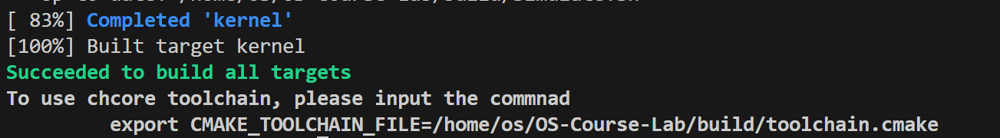
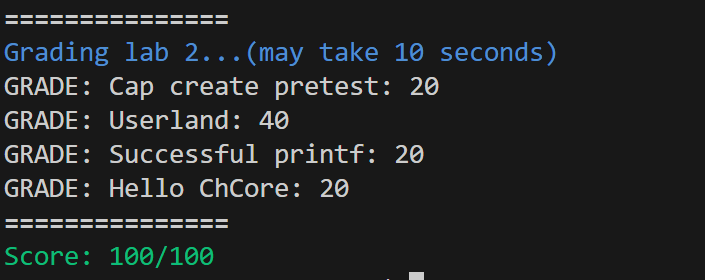
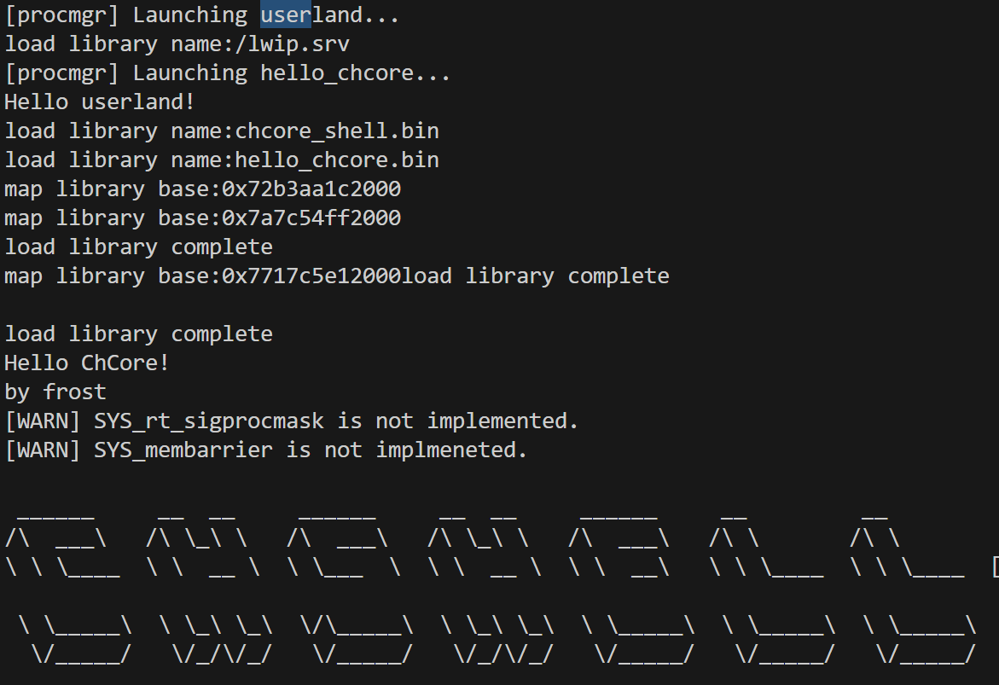

# 实验 3 报告：进程与线程

## Preparation
> 练习 0: 在项目根目录下运行以下命令以拉取 `musl-libc` 代码。
>```bash
> git submodule update --init --recursive
>```
> 使用 `make build` 检查是否能够正确项目编译。

成功编译。截图如下:



## 第一部分：用户进程和线程

> 练习 1: 在 `kernel/object/cap_group.c` 中完善 `sys_create_cap_group`、`create_root_cap_group` 函数。在完成填写之后，你可以通过 Cap create pretest 测试点。

sys_create_cap_group函数：
``` c
/* LAB 3 TODO BEGIN */
new_cap_group = obj_alloc(TYPE_CAP_GROUP, sizeof(struct cap_group));
/* LAB 3 TODO END */

/* LAB 3 TODO BEGIN */
/* initialize cap group */
cap_group_init(new_cap_group, BASE_OBJECT_NUM, args.badge);
/* LAB 3 TODO END */

/* 2st cap is vmspace */
/* LAB 3 TODO BEGIN */
vmspace = obj_alloc(TYPE_VMSPACE, sizeof(struct vmspace));
/* LAB 3 TODO END */
```
create_root_cap_group 函数:
``` c
/* LAB 3 TODO BEGIN */
cap_group = obj_alloc(TYPE_CAP_GROUP, sizeof(struct cap_group));
/* LAB 3 TODO END */
BUG_ON(!cap_group);

/* LAB 3 TODO BEGIN */
/* initialize cap group, use ROOT_CAP_GROUP_BADGE */
cap_group_init(cap_group, BASE_OBJECT_NUM, ROOT_CAP_GROUP_BADGE);
/* LAB 3 TODO END */
slot_id = cap_alloc(cap_group, cap_group);

BUG_ON(slot_id != CAP_GROUP_OBJ_ID);

/* LAB 3 TODO BEGIN */
vmspace = obj_alloc(TYPE_VMSPACE, sizeof(struct vmspace));
/* LAB 3 TODO END */
BUG_ON(!vmspace);

/* fixed PCID 1 for root process, PCID 0 is not used. */
vmspace_init(vmspace, ROOT_PROCESS_PCID);

/* LAB 3 TODO BEGIN */
slot_id = cap_alloc(cap_group, vmspace);
/* LAB 3 TODO END */
```

> 练习 2: 在 `kernel/object/thread.c` 中完成 `create_root_thread` 函数，将用户程序 ELF 加载到刚刚创建的进程地址空间中。

首先仿照flags，获取offset, vaddr, filesz, memsz。而后使用create_pmo创建pmo。接下来使用memcpy将elf内容复制到内存。最后通过flags判断读写执行标志位，设置vmspace的标志。
``` c
/* LAB 3 TODO BEGIN */
/* Get offset, vaddr, filesz, memsz from image*/
memcpy(data,
        (void *)((unsigned long)&binary_procmgr_bin_start
                + ROOT_PHDR_OFF + i * ROOT_PHENT_SIZE
                + PHDR_OFFSET_OFF),
        sizeof(data));
offset = (unsigned long)le64_to_cpu(*(u64 *)data);

memcpy(data,
        (void *)((unsigned long)&binary_procmgr_bin_start
                + ROOT_PHDR_OFF + i * ROOT_PHENT_SIZE
                + PHDR_VADDR_OFF),
        sizeof(data));
vaddr = (unsigned long)le64_to_cpu(*(u64 *)data);

memcpy(data,
        (void *)((unsigned long)&binary_procmgr_bin_start
                + ROOT_PHDR_OFF + i * ROOT_PHENT_SIZE
                + PHDR_FILESZ_OFF),
        sizeof(data));
filesz = (unsigned long)le64_to_cpu(*(u64 *)data);

memcpy(data,
        (void *)((unsigned long)&binary_procmgr_bin_start
                + ROOT_PHDR_OFF + i * ROOT_PHENT_SIZE
                + PHDR_MEMSZ_OFF),
        sizeof(data));
memsz = (unsigned long)le64_to_cpu(*(u64 *)data);
/* LAB 3 TODO END */

struct pmobject *segment_pmo;
/* LAB 3 TODO BEGIN */
ret = create_pmo(ROUND_UP(memsz,PAGE_SIZE), 
                PMO_DATA, 
                root_cap_group, 
                0, 
                &segment_pmo);
/* LAB 3 TODO END */

BUG_ON(ret < 0);

/* LAB 3 TODO BEGIN */
/* Copy elf file contents into memory*/
memset((void *)phys_to_virt(segment_pmo->start),
        0,
        segment_pmo->size);
memcpy((void *)phys_to_virt(segment_pmo->start),
        (void *)(((unsigned long)&binary_procmgr_bin_start)+offset+ROOT_BIN_HDR_SIZE),
        filesz);
/* LAB 3 TODO END */

unsigned vmr_flags = 0;    
/* LAB 3 TODO BEGIN */
/* Set flags*/
if (flags & PHDR_FLAGS_R)
        vmr_flags |= VMR_READ;
if (flags & PHDR_FLAGS_W)
        vmr_flags |= VMR_WRITE;
if (flags & PHDR_FLAGS_X)
        vmr_flags |= VMR_EXEC;
/* LAB 3 TODO END */
```
> 练习 3: 在 `kernel/arch/aarch64/sched/context.c` 中完成 `init_thread_ctx` 函数，完成线程上下文的初始化。

这里将stack、func、SPSR_EL1_EL0t保存到SP_EL0, ELR_EL1, SPSR_EL1三个寄存器。
``` c
/* LAB 3 TODO BEGIN */
/* SP_EL0, ELR_EL1, SPSR_EL1*/
thread->thread_ctx->ec.reg[SP_EL0] = stack;
thread->thread_ctx->ec.reg[ELR_EL1] = func;
thread->thread_ctx->ec.reg[SPSR_EL1] = SPSR_EL1_EL0t;
/* LAB 3 TODO END */
```
> 思考题 4: 思考内核从完成必要的初始化到第一次切换到用户态程序的过程是怎么样的？尝试描述一下调用关系。

Chcore 完成必要初始化后，调用 process_create_root 创建一个根进程。该进程会先从磁盘中载入 ELF 文件，然后创建进程的 process 结构体并初始化。接下来进程会创建一个主线程，程序首先调用 `switch_context` 初始化线程上下文，然后调用`eret_to_thread()`函数，填写异常向量表。`eret_to_thread()`函数最后会进入`exception_exit`，这个模块会使用 eret 指令完成从内核模式到用户模式的切换，并在用户模式下开始运行用户代码。

## 第二部分：异常向量表

> 练习 5: 按照前文所述的表格填写 `kernel/arch/aarch64/irq/irq_entry.S` 中的异常向量表，并且增加对应的函数跳转操作。

填写异常向量表：
```
/* LAB 3 TODO BEGIN */
exception_entry sync_el1t
exception_entry irq_el1t
exception_entry fiq_el1t
exception_entry error_el1t

exception_entry sync_el1h
exception_entry irq_el1h
exception_entry fiq_el1h
exception_entry error_el1h

exception_entry sync_el0_64
exception_entry irq_el0_64
exception_entry fiq_el0_64
exception_entry error_el0_64

exception_entry sync_el0_32
exception_entry irq_el0_32
exception_entry fiq_el0_32
exception_entry error_el0_32
/* LAB 3 TODO END */
```

增加函数跳转操作：
```
irq_el1t:
fiq_el1t:
fiq_el1h:
error_el1t:
error_el1h:
sync_el1t:
/* LAB 3 TODO BEGIN */
bl unexpected_handler
/* LAB 3 TODO END */
···
/* LAB 3 TODO BEGIN */
/* jump to handle_entry_c, store the return value as the ELR_EL1 */
bl	handle_entry_c
str x0, [sp, #16 * 16]
/* LAB 3 TODO END */
```
## 第三部分：系统调用

> 练习 6: 填写 `kernel/arch/aarch64/irq/irq_entry.S` 中的 `exception_enter` 与 `exception_exit`，实现上下文保存的功能，以及 `switch_to_cpu_stack` 内核栈切换函数。如果正确完成这一部分，可以通过 Userland 测试点。这代表着程序已经可以在用户态与内核态间进行正确切换。显示如下结果
>
> ```
> Hello userland!
> ```
在进入异常态前保存所有用户状态（处理器上下文），完成系统调用后，退出异常态，恢复用户状态。
exception_enter:
```
.macro	exception_enter

	/* LAB 3 TODO BEGIN */
	sub sp, sp, #ARCH_EXEC_CONT_SIZE
	stp	x0, x1, [sp, #16 * 0]
	stp	x2, x3, [sp, #16 * 1]
	stp	x4, x5, [sp, #16 * 2]
	stp	x6, x7, [sp, #16 * 3]
	stp	x8, x9, [sp, #16 * 4]
	stp	x10, x11, [sp, #16 * 5]
	stp	x12, x13, [sp, #16 * 6]
	stp	x14, x15, [sp, #16 * 7]
	stp	x16, x17, [sp, #16 * 8]
	stp	x18, x19, [sp, #16 * 9]
	stp	x20, x21, [sp, #16 * 10]
	stp	x22, x23, [sp, #16 * 11]
	stp	x24, x25, [sp, #16 * 12]
	stp	x26, x27, [sp, #16 * 13]
	stp	x28, x29, [sp, #16 * 14]
	/* LAB 3 TODO END */

	mrs	x21, sp_el0
	mrs	x22, elr_el1
	mrs	x23, spsr_el1

	/* LAB 3 TODO BEGIN */
	stp	x30, x21, [sp, #16 * 15]
	stp	x22, x23, [sp, #16 * 16]
	/* LAB 3 TODO END */
```
exception_exit:
```
.macro	exception_exit

	/* LAB 3 TODO BEGIN */
	ldp	x22, x23, [sp, #16 * 16]
	ldp	x30, x21, [sp, #16 * 15] 
	/* LAB 3 TODO END */

	msr	sp_el0, x21
	msr	elr_el1, x22
	msr	spsr_el1, x23

	/* LAB 3 TODO BEGIN */
	ldp	x0, x1, [sp, #16 * 0]
	ldp	x2, x3, [sp, #16 * 1]
	ldp	x4, x5, [sp, #16 * 2]
	ldp	x6, x7, [sp, #16 * 3]
	ldp	x8, x9, [sp, #16 * 4]
	ldp	x10, x11, [sp, #16 * 5]
	ldp	x12, x13, [sp, #16 * 6]
	ldp	x14, x15, [sp, #16 * 7]
	ldp	x16, x17, [sp, #16 * 8]
	ldp	x18, x19, [sp, #16 * 9]
	ldp	x20, x21, [sp, #16 * 10]
	ldp	x22, x23, [sp, #16 * 11]
	ldp	x24, x25, [sp, #16 * 12]
	ldp	x26, x27, [sp, #16 * 13]
	ldp	x28, x29, [sp, #16 * 14]
	add	sp, sp, #ARCH_EXEC_CONT_SIZE
	/* LAB 3 TODO END */

	eret
```

```
add	x24, x24, #OFFSET_LOCAL_CPU_STACK
```
> 思考 7: 尝试描述 `printf` 如何调用到 `chcore_stdout_write` 函数。

printf调用vfprintf，同时传入文件描述符STDOUT，在`syscall_dispatcher.c`中我们可以看到STDOUT的具体定义，其中有下面这行代码：
``` c
fd_dic[fd1]->fd_op = &stdout_ops;
```
其中`stdout_ops`的类型是`fd_ops`。接下来在stoio.c中fd_ops结构体定义中，可以发现`.write = chcore_stdout_write`，至此，printf调用到了`chcore_stdout_write`


> 练习 8: 在其中添加一行以完成系统调用，目标调用函数为内核中的 `sys_putstr`。使用 `chcore_syscallx` 函数进行系统调用。
在`stdio.c`中put函数添加
```
/* LAB 3 TODO BEGIN */
usys_putstr((vaddr_t) buffer,size);
/* LAB 3 TODO END */
```
而`usys_putstr`调用`chcore_syscall2`从而完成系统调用。

## 第四部分：Hello ChCore

> 练习 9: 尝试编写一个简单的用户程序，其作用至少包括打印以下字符(测试将以此为得分点)。
>```
> Hello ChCore!
>```
> 使用 chcore-libc 的编译器进行对其进行编译，编译输出文件名命名为 `hello_chcore.bin`，并将其放入 ramdisk 加载进内核运行。内核启动时将自动运行 文件名为 `hello_chcore.bin` 的可执行文件。

编写程序如下：
``` c
#include <stdio.h>

int main()
{
        printf("Hello ChCore!\n");
        printf("by frost\n");
        return 0;
}
```
然后使用`build/chcore-libc/bin/musl-gcc helloworld.c -o hello_chcore.bin`，将生成文件放入ramdisk中。

## 最终执行与得分

得分：


make qemu:
