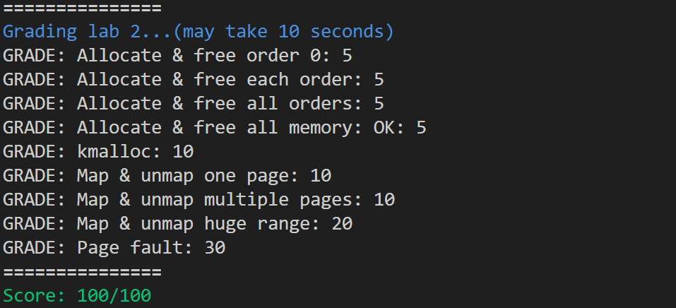

# 实验报告2：内存管理

## 第一部分：物理内存管理

> 练习题 1：完成 `kernel/mm/buddy.c` 中的 `split_chunk`、`merge_chunk`、`buddy_get_pages`、 和 `buddy_free_pages` 函数中的 `LAB 2 TODO 1` 部分，其中 `buddy_get_pages` 用于分配指定阶大小的连续物理页，`buddy_free_pages` 用于释放已分配的连续物理页。
>
> 提示：
>
> - 可以使用 `kernel/include/common/list.h` 中提供的链表相关函数和宏如 `init_list_head`、`list_add`、`list_del`、`list_entry` 来对伙伴系统中的空闲链表进行操作
> - 可使用 `get_buddy_chunk` 函数获得某个物理内存块的伙伴块
> - 更多提示见代码注释

1. 首先在 `split_chunk` 函数中将给定的 `chunk` 划分为 `order` 大小的chunk，具体的思路是递归下降chunk的order，将chunk分成两块chunk->order-1的chunk，然后将其中一块放入对应的freelist，另一块（chunk初始地址那块）继续递归二分直到chunk->order为order。
``` c
/* The most recursion level of split_chunk is decided by the macro of
 * BUDDY_MAX_ORDER. */
static struct page *split_chunk(struct phys_mem_pool *pool, int order,
                                struct page *chunk)
{
        /* LAB 2 TODO 1 BEGIN */
        /*
         * Hint: Recursively put the buddy of current chunk into
         * a suitable free list.
         */
        /* BLANK BEGIN */
        list_del(&(chunk->node));
        struct page *bd_chunk;
        while (chunk->order>order) {
                chunk->order--;
                bd_chunk = get_buddy_chunk(pool,chunk);
                bd_chunk->order=chunk->order;
                bd_chunk->allocated=0;
                bd_chunk->pool=pool;
                list_add(&(bd_chunk->node),&(pool->free_lists[bd_chunk->order].free_list));
                pool->free_lists[bd_chunk->order].nr_free++;
        }
        return chunk;
        /* BLANK END */
        /* LAB 2 TODO 1 END */
}
```

2. 接下来实现 `merge_chunk` 函数，思路是看最开始的chunk的buddy是否存在且未分配且未被划分为小块（`bd_chunk->order != chunk->order`），若是，则将buddy从freelist取出合并。接下来分析合并后的chunk是否可以继续合并，若可以，则继续合并，直至不能再合并。
```c 
static struct page *merge_chunk(struct phys_mem_pool *pool, struct page *chunk)
{
        /* LAB 2 TODO 1 BEGIN */
        /*
         * Hint: Recursively merge current chunk with its buddy
         * if possible.
         */
        /* BLANK BEGIN */
        struct page *bd_chunk;
        while (chunk->order<BUDDY_MAX_ORDER-1) {
                bd_chunk = get_buddy_chunk(pool,chunk);
                if (bd_chunk==NULL || bd_chunk->allocated==1 || bd_chunk->order != chunk->order) break;
                list_del(&(bd_chunk->node));
                pool->free_lists[bd_chunk->order].nr_free--;
                if (chunk>bd_chunk) {
                        chunk=bd_chunk;
                }
                chunk->order++;
        }
        return chunk;
        /* BLANK END */
        /* LAB 2 TODO 1 END */
}
```

3. 然后在 `buddy_get_pages` 函数中利用 `split_chunk` 实现 page 分配。思路是在 `free_lists[order]` 中从给定 `order` 开始，向上遍历寻找有空闲page的 `freelists[curr_order]` 。从该freelist取出page，然后使用 `split_chunk` 将其划分为 大小为 order 的 page，从而进行分配。（不需划分的情况是划分的一种特例。）
```c
/* LAB 2 TODO 1 BEGIN */
/*
    * Hint: Find a chunk that satisfies the order requirement
    * in the free lists, then split it if necessary.
    */
/* BLANK BEGIN */
cur_order = order;
while (!(pool->free_lists[cur_order].nr_free)) {
        cur_order++;
        if (cur_order>BUDDY_MAX_ORDER) {
                goto out;
        }
}
free_list = pool->free_lists[cur_order].free_list.next;
struct page *sp_chunk = list_entry(free_list,struct page,node);
list_del(&(sp_chunk->node));
pool->free_lists[sp_chunk->order].nr_free--;
page = split_chunk(pool,order,sp_chunk);
page->allocated=1;
/* BLANK END */
/* LAB 2 TODO 1 END */
```

4. 最后我们在 `buddy_free_pages` 函数中利用 `merge_chunk` 实现空间的释放。思路是把释放的page递归于它的buddy进行合并，然后将最终结果放进对应`free_list`。
```c
/* LAB 2 TODO 1 BEGIN */
/*
    * Hint: Merge the chunk with its buddy and put it into
    * a suitable free list.
    */
/* BLANK BEGIN */
page=merge_chunk(pool,page);
page->allocated=0;
order = page->order;
free_list = &(pool->free_lists[order].free_list);
list_add(&(page->node), free_list);
pool->free_lists[order].nr_free++;
/* BLANK END */
/* LAB 2 TODO 1 END */
```


> 练习题 2：完成 `kernel/mm/slab.c` 中的 `choose_new_current_slab`、`alloc_in_slab_impl` 和 `free_in_slab` 函数中的 `LAB 2 TODO 2` 部分，其中 `alloc_in_slab_impl` 用于在 slab 分配器中分配指定阶大小的内存，而 `free_in_slab` 则用于释放上述已分配的内存。
>
> 提示：
>
> - 你仍然可以使用上个练习中提到的链表相关函数和宏来对 SLAB 分配器中的链表进行操作
> - 更多提示见代码注释

1. 首先在 `choose_new_current_slab` 函数中实现从 `partial_slab_list` 中方选取一个新的 `current_slab` 。如果 `partial_slab_list` 为空，则申请一块新的 slab 作为 current_slab。
```c 
static void choose_new_current_slab(struct slab_pointer *pool, int order)
{
        /* LAB 2 TODO 2 BEGIN */
        /* Hint: Choose a partial slab to be a new current slab. */
        /* BLANK BEGIN */
        struct slab_header *slab;
        if (list_empty(&pool->partial_slab_list)) {
                slab = init_slab_cache(order, SIZE_OF_ONE_SLAB);
                pool->current_slab = slab;
                return;
        }
        slab = list_entry(pool->partial_slab_list.next,struct slab_header, node);
        list_del(pool[order].partial_slab_list.next);
        pool->current_slab = slab;
        /* BLANK END */
        /* LAB 2 TODO 2 END */
}
```

2. 在 `alloc_in_slab_impl` 中实现 slot 的分配。如果 current_slab 已无空余，则选取新的`current_slab`进行分配。分配的过程是将current_slab->free_list_head指向下一个slot。
```c
/* LAB 2 TODO 2 BEGIN */
/*
    * Hint: Find a free slot from the free list of current slab.
    * If current slab is full, choose a new slab as the current one.
    */
/* BLANK BEGIN */
if (current_slab->current_free_cnt==0) {
        choose_new_current_slab(&slab_pool[order],order);
        current_slab = slab_pool[order].current_slab;
}
current_slab->current_free_cnt--;
free_list = current_slab->free_list_head;
next_slot = free_list->next_free;
current_slab->free_list_head = next_slot;
/* BLANK END */
/* LAB 2 TODO 2 END */
```

3. 最后我们补全 `free_in_slab` 函数实现已分配slot的释放，我们通过之前定义函数得到addr对应的slot和slab，然后将slot插进slab开头。
```c
/* LAB 2 TODO 2 BEGIN */
/*
    * Hint: Free an allocated slot and put it back to the free list.
    */
/* BLANK BEGIN */
slot->next_free = slab->free_list_head;
slab->free_list_head = slot;
slab->current_free_cnt++;
/* BLANK END */
/* LAB 2 TODO 2 END */
```


> 练习题 3：完成 `kernel/mm/kmalloc.c` 中的 `_kmalloc` 函数中的 `LAB 2 TODO 3` 部分，在适当位置调用对应的函数，实现 `kmalloc` 功能
>
> 提示：
>
> - 你可以使用 `get_pages` 函数从伙伴系统中分配内存，使用 `alloc_in_slab` 从 SLAB 分配器中分配内存
> - 更多提示见代码注释

在step1中调用alloc_in_slab从SLAB 分配器中分配内存，在step2中先将size转化为对应的阶，再使用 get_pages 函数从伙伴系统中分配内存。
```c
/* LAB 2 TODO 3 BEGIN */
/* Step 1: Allocate in slab for small requests. */
/* BLANK BEGIN */
return alloc_in_slab(size,real_size);
/* BLANK END */
...
/* Step 2: Allocate in buddy for large requests. */
/* BLANK BEGIN */
order = size_to_page_order(size);
return get_pages(order);
/* BLANK END */
/* LAB 2 TODO 3 END */
```

make grade成功得到30分。

## 第二部分：页表管理


> 练习题 4：完成 `kernel/arch/aarch64/mm/page_table.c` 中的 `query_in_pgtbl`、`map_range_in_pgtbl_common`、`unmap_range_in_pgtbl` 和 `mprotect_in_pgtbl` 函数中的 `LAB 2 TODO 4` 部分，分别实现页表查询、映射、取消映射和修改页表权限的操作，以 4KB 页为粒度。
>
> 提示：
>
> - 需要实现的函数内部无需刷新 TLB，TLB 刷新会在这些函数的外部进行
> - 实现中可以使用 `get_next_ptp`、`set_pte_flags`、`virt_to_phys`、`GET_LX_INDEX` 等已经给定的函数和宏
> - `map_range_in_pgtbl_common`、`unmap_range_in_pgtbl`、`get_next_ptp` 中的 `rss` 参数是用于统计物理内存使用量的[^rss]，在本实验中你不必实现该功能，该功能的正确实现与否不影响本题得分。在调用 `get_next_ptp` 时可以直接使用 `NULL` 作为 `rss` 参数。（当然你也可以选择正确实现这一功能）
> - 更多提示见代码注释

1. `query_in_pgtbl` 页表查询：从第0级页表开始，使用`get_next_ptp`获取下一级页表及载该页表对应页表项。每次都要检查返回值判断是否正常返回，若返回值为负，说明发生了错误，中止函数返回负值，若返回值为`BLOCK_PTP(1)`，说明是一个大页表项，获取对应物理地址和对应页表项然后返回。否则遍历四级页表得到最终物理地址和对应页表项返回。
```c
/*
 * Translate a va to pa, and get its pte for the flags
 */
int query_in_pgtbl(void *pgtbl, vaddr_t va, paddr_t *pa, pte_t **entry)
{
        /* LAB 2 TODO 4 BEGIN */
        /*
         * Hint: Walk through each level of page table using `get_next_ptp`,
         * return the pa and pte until a L0/L1 block or page, return
         * `-ENOMAPPING` if the va is not mapped.
         */
        /* BLANK BEGIN */
        ptp_t *l0_ptp, *l1_ptp, *l2_ptp, *l3_ptp;
        ptp_t *phys_page;
        pte_t *pte;
        int ret;

        // L0 page table
        l0_ptp = (ptp_t *)pgtbl;
        ret = get_next_ptp(l0_ptp, L0, va, &l1_ptp, &pte, false, NULL);
        if (ret < 0) return ret;

        // L1 page table
        ret = get_next_ptp(l1_ptp, L1, va, &l2_ptp, &pte, false, NULL);
        if (ret < 0) return ret;
        if (ret == BLOCK_PTP) {
                if (entry != NULL) *entry = pte;
                *pa = virt_to_phys((vaddr_t)l2_ptp) + GET_VA_OFFSET_L1(va);
                return 0;
        }

        // L2 page table
        ret = get_next_ptp(l2_ptp, L2, va, &l3_ptp, &pte, false, NULL);
        if (ret < 0) return ret;
        if (ret == BLOCK_PTP) {
                if (entry != NULL) *entry = pte;
                *pa = virt_to_phys((vaddr_t)l3_ptp) + GET_VA_OFFSET_L2(va);
                return 0;
        }

        // L3 page table
        ret = get_next_ptp(l3_ptp, L3, va, &phys_page, &pte, false, NULL);
        if (ret < 0) return ret;
        if (entry != NULL) *entry = pte;
        *pa = virt_to_phys((vaddr_t)phys_page) + GET_VA_OFFSET_L3(va);
        
        /* BLANK END */
        /* LAB 2 TODO 4 END */
        return 0;
}
```

2. `map_range_in_pgtbl_common`页表映射：从va开始，遍历长度为len的内存，对每一张页表建立映射。运行三次`get_next_ptp`得到最后一级页表页表项，使用set_pte_flags(pte, flags, kind)设置flag并且修改is_vaild、is_page、pfn。
```c
static int map_range_in_pgtbl_common(void *pgtbl, vaddr_t va, paddr_t pa, size_t len,
                       vmr_prop_t flags, int kind, long *rss)
{
        /* LAB 2 TODO 4 BEGIN */
        /*
         * Hint: Walk through each level of page table using `get_next_ptp`,
         * create new page table page if necessary, fill in the final level
         * pte with the help of `set_pte_flags`. Iterate until all pages are
         * mapped.
         * Since we are adding new mappings, there is no need to flush TLBs.
         * Return 0 on success.
         */
        /* BLANK BEGIN */
        ptp_t *l0_ptp, *l1_ptp, *l2_ptp, *l3_ptp;
        pte_t *pte;
        int ret;
        l0_ptp = (ptp_t *)pgtbl;
        size_t i;
        for (i = 0; i < len; i += PAGE_SIZE) {
                ret = get_next_ptp(l0_ptp, 0, va + i, &l1_ptp, &pte, 1, NULL);
                if (ret < 0) return ret;
                ret = get_next_ptp(l1_ptp, 1, va + i, &l2_ptp, &pte, 1, NULL);
                if (ret < 0) return ret;
                ret = get_next_ptp(l2_ptp, 2, va + i, &l3_ptp, &pte, 1, NULL);
                if (ret < 0) return ret;
                int index = GET_L3_INDEX(va + i);
                pte = &(l3_ptp->ent[index]);
                pte->l3_page.is_valid = 1;
                pte->l3_page.is_page = 1;
                pte->l3_page.pfn = (pa + i) >> 12;
                set_pte_flags(pte, flags, kind);
        }
        /* BLANK END */
        /* LAB 2 TODO 4 END */
        return 0;
}
```

1. `unmap_range_in_pgtbl`取消页表映射：从va开始，遍历长度为len的内存，对每一张页表取消映射。将`pte->pte` 设置为 `PTE_DESCRIPTOR_INVALID` 并且使用recycle_pgtable_entry回收0、1、2级页表项。
```c
int unmap_range_in_pgtbl(void *pgtbl, vaddr_t va, size_t len, long *rss)
{
        /* LAB 2 TODO 4 BEGIN */
        /*
         * Hint: Walk through each level of page table using `get_next_ptp`,
         * mark the final level pte as invalid. Iterate until all pages are
         * unmapped.
         * You don't need to flush tlb here since tlb is now flushed after
         * this function is called.
         * Return 0 on success.
         */
        /* BLANK BEGIN */
        ptp_t *l0_ptp, *l1_ptp, *l2_ptp, *l3_ptp;
        pte_t *pte;
        int ret;
        l0_ptp = (ptp_t *)pgtbl;
        size_t i;
        for (i = 0; i < len; i += PAGE_SIZE) {
                ret = get_next_ptp(l0_ptp, 0, va + i, &l1_ptp, &pte, 0, rss);
                if (ret < 0) return ret;
                ret = get_next_ptp(l1_ptp, 1, va + i, &l2_ptp, &pte, 0, rss);
                if (ret < 0) return ret;
                ret = get_next_ptp(l2_ptp, 2, va + i, &l3_ptp, &pte, 0, rss);
                if (ret < 0) return ret;
                int index = GET_L3_INDEX(va + i);
                pte = &(l3_ptp->ent[index]);
                pte->pte = PTE_DESCRIPTOR_INVALID; 
                recycle_pgtable_entry(l0_ptp, l1_ptp, l2_ptp, l3_ptp, va+i, rss);
        }
        /* BLANK END */
        /* LAB 2 TODO 4 END */

        dsb(ishst);
        isb();

        return 0;
}
```

1. `mprotect_in_pgtbl`修改页表权限：从va开始，遍历长度为len的内存，对每一张页表建立映射。运行三次`get_next_ptp`得到最后一级页表页表项，使用set_pte_flags(pte, flags, kind)修改页表权限。
```c
int mprotect_in_pgtbl(void *pgtbl, vaddr_t va, size_t len, vmr_prop_t flags)
{
        /* LAB 2 TODO 4 BEGIN */
        /*
         * Hint: Walk through each level of page table using `get_next_ptp`,
         * modify the permission in the final level pte using `set_pte_flags`.
         * The `kind` argument of `set_pte_flags` should always be `USER_PTE`.
         * Return 0 on success.
         */
        /* BLANK BEGIN */
        size_t i;
        for (i = 0; i < len; i += PAGE_SIZE) {
                // kdebug("i: %lld\n", i);
                ptp_t *page = pgtbl;
                pte_t *pte;
                int ret;
                ret = get_next_ptp(page, 0, va + i, &page, &pte, 1, NULL);
                if (ret < 0) return ret;
                ret = get_next_ptp(page, 1, va + i, &page, &pte, 1, NULL);
                if (ret < 0) return ret;
                ret = get_next_ptp(page, 2, va + i, &page, &pte, 1, NULL);
                if (ret < 0) return ret;
                int index = GET_L3_INDEX(va + i);
                pte = &(page->ent[index]);
                set_pte_flags(pte, flags, USER_PTE);
        }
        /* BLANK END */
        /* LAB 2 TODO 4 END */
        return 0;
}
```

> 思考题 5：阅读 Arm Architecture Reference Manual，思考要在操作系统中支持写时拷贝（Copy-on-Write，CoW）[^cow]需要配置页表描述符的哪个/哪些字段，并在发生页错误时如何处理。（在完成第三部分后，你也可以阅读页错误处理的相关代码，观察 ChCore 是如何支持 Cow 的）

需要配置页表是否可写的权限位字段。当多个进程或线程需要访问相同的数据时，它们会共享相同的物理内存页，它们对其只有读权限。当某个进程尝试写入共享的数据时，就会触发页错误，这时候系统执行复制操作，创建一个可写的新的物理页，将原始只读页的内容复制到新的物理页，确保写入操作不会影响其他进程共享页。


> 思考题 6：为了简单起见，在 ChCore 实验 Lab1 中没有为内核页表使用细粒度的映射，而是直接沿用了启动时的粗粒度页表，请思考这样做有什么问题。

1. 性能问题：导致内核需要在地址转换过程中浪费更多的时间，造成内核访问内存的性能下降。
2. 物理内存资源浪费：产生较多的内部碎片。

## 第三部分：缺页异常处理

> 练习题 8: 完成 `kernel/arch/aarch64/irq/pgfault.c` 中的 `do_page_fault` 函数中的 `LAB 2 TODO 5` 部分，将缺页异常转发给 `handle_trans_fault` 函数。

调用handle_trans_fault函数即可。
```c
ret = handle_trans_fault(current_thread->vmspace, fault_addr);
```

> 练习题 9: 完成 `kernel/mm/vmspace.c` 中的 `find_vmr_for_va` 函数中的 `LAB 2 TODO 6` 部分，找到一个虚拟地址找在其虚拟地址空间中的 VMR。
>
> 提示：
>
> - 一个虚拟地址空间所包含的 VMR 通过 rb_tree 的数据结构保存在 `vmspace` 结构体的 `vmr_tree` 字段
> - 可以使用 `kernel/include/common/rbtree.h` 中定义的 `rb_search`、`rb_entry` 等函数或宏来对 rb_tree 进行搜索或操作

一开始的想法是使用rb_for_each进行暴力枚举，观察addr在哪一个node对应的地址范围，后来发现使用rb_search效率更高，比较函数可以使用上面已经实现的`cmp_vmr_and_va`。获得对应的node之后，使用 `rb_entry` 获取它所在的vmr。
```c
struct vmregion *find_vmr_for_va(struct vmspace *vmspace, vaddr_t addr)
{
        /* LAB 2 TODO 6 BEGIN */
        /* Hint: Find the corresponding vmr for @addr in @vmspace */
        /* BLANK BEGIN */
        // struct vmregion *vmr;
        // vaddr_t start, end;
        // struct rb_node* node; 
        // rb_for_each(&(vmspace->vmr_tree), node) {
        //         vmr = rb_entry(node, struct vmregion, tree_node);
        //         start = vmr->start;
        //         end = start + vmr->size;
        //         if (addr >= start && addr < end)
        //                 return vmr;
        // }
        // return NULL;
        struct vmregion *vmr;
        struct rb_node* node = rb_search(&(vmspace->vmr_tree),(void *)addr, cmp_vmr_and_va);
        vmr = rb_entry(node, struct vmregion, tree_node);
        return vmr;
        /* BLANK END */
        /* LAB 2 TODO 6 END */
}
```


> 练习题 10: 完成 `kernel/mm/pgfault_handler.c` 中的 `handle_trans_fault` 函数中的 `LAB 2 TODO 7` 部分（函数内共有 3 处填空，不要遗漏），实现 `PMO_SHM` 和 `PMO_ANONYM` 的按需物理页分配。你可以阅读代码注释，调用你之前见到过的相关函数来实现功能。

第一空使用get_pages分配页，再使用virt_to_phys将虚拟地址转化为物理地址，然后使用memset将该page清零。第二空使用`map_range_in_pgtbl`进行映射。第三空对已有对应物理页的地址使用`map_range_in_pgtbl`进行映射。
```c
/* LAB 2 TODO 7 BEGIN */
/* BLANK BEGIN */
/* Hint: Allocate a physical page and clear it to 0. */
pa = virt_to_phys(get_pages(0));
memset((void *)phys_to_virt(pa), 0, PAGE_SIZE);
/* BLANK END */
...
/* BLANK BEGIN */
map_range_in_pgtbl(vmspace->pgtbl, fault_addr, pa, PAGE_SIZE, vmr->perm, &rss);
/* BLANK END */
...
/* BLANK BEGIN */
map_range_in_pgtbl(vmspace->pgtbl, fault_addr, pa, PAGE_SIZE, vmr->perm, &rss);
/* BLANK END */
/* LAB 2 TODO 7 END */
```

## 最后成绩
