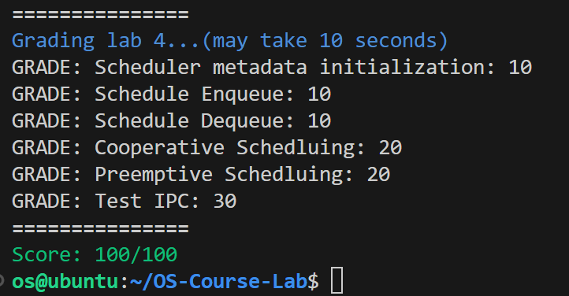

# 实验 4：多核调度与IPC 报告

## 第一部分：多核支持

### 启动多核

> 思考题 1：阅读汇编代码kernel/arch/aarch64/boot/raspi3/init/start.S。说明ChCore是如何选定主CPU，并阻塞其他其他CPU的执行的。

_start函数开头如下所示：

``` asm
BEGIN_FUNC(_start)
    mrs x8, mpidr_el1
    and x8, x8, #0xFF
    cbz x8, primary

    /* Wait for bss clear */
wait_for_bss_clear:
    adr x0, clear_bss_flag
    ldr x1, [x0]
    cmp     x1, #0
    bne wait_for_bss_clear
```

mpidr_el1 用于在 ARMv8-A 体系结构中处理多核处理器的多核调度和控制，它的最后八位表示 CPU 的本地标识符 (CPU Affinity)，是辨识CPU的标志。如果这八位为0，说明这个核是CPU的引导核心。`cbz x8, primary` 使得引导核心，也就是核1进入了primary函数。其它三个核进入`wait_for_bss_clear`, 这个函数是一个循环指令。bss如果没有clear，就会一直循环下去。从而实现让其中一个核首先进入初始化流程，并阻塞其他其他CPU的执行的。


> 思考题 2：阅读汇编代码kernel/arch/aarch64/boot/raspi3/init/start.S, init_c.c以及kernel/arch/aarch64/main.c，解释用于阻塞其他CPU核心的secondary_boot_flag是物理地址还是虚拟地址？是如何传入函数enable_smp_cores中，又是如何赋值的（考虑虚拟地址/物理地址）？

- 是虚拟地址，secondary_boot_flag由smp.c的enable_smp_cores函数改变。
```c
void enable_smp_cores(paddr_t boot_flag){
    ...
    secondary_boot_flag = (long *)phys_to_virt(boot_flag);
    ...
}
```
- main函数调用了enable_smp_cores，将boot_flag传递给enable_smp_cores，在enable_smp_cores中由物理地址转化为虚拟地址，也就是secondary_boot_flag。


## 第二部分：多核调度

### 调度队列初始化
> 练习 1：在 kernel/sched/policy_rr.c 中完善 `rr_sched_init` 函数，对 `rr_ready_queue_meta` 进行初始化。在完成填写之后，你可以看到输出“Scheduler metadata is successfully initialized!”并通过 Scheduler metadata initialization 测试点。
> 
> 提示：sched_init 只会在主 CPU 初始化时调用，因此 rr_sched_init 需要对每个 CPU 核心的就绪队列都进行初始化。

遍历CPU 核心的就绪队列，进行初始化：
```c
/* Initial the ready queues (rr_ready_queue_meta) for each CPU core */
for (int i=0; i<PLAT_CPU_NUM; i++) {
        current_threads[i]=NULL;
        rr_ready_queue_meta[i].queue_len=0;
        init_list_head(&(rr_ready_queue_meta[i].queue_head));
        lock_init(&rr_ready_queue_meta[i].queue_lock);
}
```
### 调度队列入队
> 练习 2：在 kernel/sched/policy_rr.c 中完善 `__rr_sched_enqueue` 函数，将`thread`插入到`cpuid`对应的就绪队列中。在完成填写之后，你可以看到输出“Successfully enqueue root thread”并通过 Schedule Enqueue 测试点。
按照提示填写即可：
```c
/* Insert thread into the ready queue of cpuid and update queue length */
/* Note: you should add two lines of code. */
rr_ready_queue_meta[cpuid].queue_len++;
list_append(&(thread->ready_queue_node),&(rr_ready_queue_meta[cpuid].queue_head));
```
### 调度队列出队
> 练习 3：在 kernel/sched/sched.c 中完善 `find_runnable_thread` 函数，在就绪队列中找到第一个满足运行条件的线程并返回。 在 kernel/sched/policy_rr.c 中完善 `__rr_sched_dequeue` 函数，将被选中的线程从就绪队列中移除。在完成填写之后，运行 ChCore 将可以成功进入用户态，你可以看到输出“Enter Procmgr Root thread (userspace)”并通过 Schedule Enqueue 测试点。

`find_runnable_thread`按照提示填写即可：
```c
/* Tip 1: use for_each_in_list to iterate the thread list */
/*
 * Tip 2: Find the first thread in the ready queue that
 * satisfies (!thread->thread_ctx->is_suspended && 
 * (thread->thread_ctx->kernel_stack_state == KS_FREE
 * || thread == current_thread))
 */
for_each_in_list (thread,struct thread,ready_queue_node,(thread_list)){
        if (!thread->thread_ctx->is_suspended && (thread->thread_ctx->kernel_stack_state == KS_FREE || thread == current_thread)){
                break;
        }
}
```
`__rr_sched_dequeue`同样按照提示填写即可：
```c
/* Delete thread from the ready queue and upate the queue length */
/* Note: you should add two lines of code. */
rr_ready_queue_meta[thread->thread_ctx->cpuid].queue_len--;
list_del(&(thread->ready_queue_node));
```
### 协作式调度
> 练习 4：在kernel/sched/sched.c中完善系统调用`sys_yield`，使用户态程序可以主动让出CPU核心触发线程调度。
> 此外，请在kernel/sched/policy_rr.c 中完善`rr_sched`函数，将当前运行的线程重新加入调度队列中。在完成填写之后，运行 ChCore 将可以成功进入用户态并创建两个线程交替执行，你可以看到输出“Cooperative Schedluing Test Done!”并通过 Cooperative Schedluing 测试点。

在sys_yield中调用sched即可：
```c
/* Note: you should just add a function call (one line of code) */
sched();
```

在rr_sched函数，调用rr_sched_enqueue(old)，将当前运行的线程重新加入调度队列中：
```c
/* Enqueue current running thread */
/* Note: you should just add a function call (one line of code) */
rr_sched_enqueue(old);
```
### 抢占式调度
**物理时钟初始化**
> 练习 5：请根据代码中的注释在kernel/arch/aarch64/plat/raspi3/irq/timer.c中完善`plat_timer_init`函数，初始化物理时钟。需要完成的步骤有：
> * 读取 CNTFRQ_EL0 寄存器，为全局变量 cntp_freq 赋值。
> * 根据 TICK_MS（由ChCore决定的时钟中断的时间间隔，以ms为单位，ChCore默认每10ms触发一次时钟中断）和cntfrq_el0 （即物理时钟的频率）计算每两次时钟中断之间 system count 的增长量，将其赋值给 cntp_tval 全局变量，并将 cntp_tval 写入 CNTP_TVAL_EL0 寄存器！
> * 根据上述说明配置控制寄存器CNTP_CTL_EL0。
> 
> 由于启用了时钟中断，但目前还没有对中断进行处理，所以会影响评分脚本的评分，你可以通过运行ChCore观察是否有"[TEST] Physical Timer was successfully initialized!: OK"输出来判断是否正确对物理时钟进行初始化。

根据提示，仿照之前对寄存器的处理，填写即可：
```c
/* Note: you should add three lines of code. */
/* Read system register cntfrq_el0 to cntp_freq*/
asm volatile ("mrs %0, cntfrq_el0":"=r" (cntp_freq));
/* Calculate the cntp_tval based on TICK_MS and cntp_freq */
cntp_tval = (cntp_freq * TICK_MS / 1000);
/* Write cntp_tval to the system register cntp_tval_el0 */
asm volatile ("msr cntp_tval_el0, %0"::"r" (cntp_tval));
...
/* Note: you should add two lines of code. */
/* Calculate the value of timer_ctl */
timer_ctl = 0 << 1 | 1; /* IMASK = 0 ENABLE = 1 */
/* Write timer_ctl to the control register (cntp_ctl_el0) */
asm volatile ("msr cntp_ctl_el0, %0"::"r" (timer_ctl));
```
**物理时钟中断与抢占**
> 练习 6：请在kernel/arch/aarch64/plat/raspi3/irq/irq.c中完善`plat_handle_irq`函数，当中断号irq为INT_SRC_TIMER1（代表中断源为物理时钟）时调用`handle_timer_irq`并返回。 请在kernel/irq/irq.c中完善`handle_timer_irq`函数，递减当前运行线程的时间片budget，并调用sched函数触发调度。 请在kernel/sched/policy_rr.c中完善`rr_sched`函数，在将当前运行线程重新加入就绪队列之前，恢复其调度时间片budget为DEFAULT_BUDGET。
> 在完成填写之后，运行 ChCore 将可以成功进入用户态并打断创建的“自旋线程”让内核和主线程可以拿回CPU核心的控制权，你可以看到输出"Hello, I am thread 3. I'm spinning."和“Thread 1 successfully regains the control!”并通过 Preemptive Scheduling 测试点。

根据提示完善plat_handle_irq，当中断号irq为INT_SRC_TIMER1（代表中断源为物理时钟）时调用`handle_timer_irq`并返回：
```c
/* Call handle_timer_irq and return if irq equals INT_SRC_TIMER1 (physical timer) */
case INT_SRC_TIMER1:
    handle_timer_irq();
    return;
```
根据提示完善handle_timer_irq，递减budget：
```c
/* Decrease the budget of current thread by 1 if current thread is not NULL */
if (current_thread!=NULL){
        current_thread->thread_ctx->sc->budget--;
}
/* Then call sched to trigger scheduling */
sched();
```
根据提示完善rr_sched，在将当前运行线程重新加入就绪队列之前，恢复其调度时间片budget为DEFAULT_BUDGET：
```c
/* Refill budget for current running thread (old) */
old->thread_ctx->sc->budget = DEFAULT_BUDGET;
```
## 第三部分：进程间通信（IPC）
### ChCore IPC具体流程
> 练习 7：在user/chcore-libc/musl-libc/src/chcore-port/ipc.c与kernel/ipc/connection.c中实现了大多数IPC相关的代码，请根据注释补全kernel/ipc/connection.c中的代码。之后运行ChCore可以看到 “[TEST] Test IPC finished!” 输出，你可以通过 Test IPC 测试点。

#### 1
register_server函数中，按照上下文填写即可：
```c
/* Record the ipc_routine_entry  */
config->declared_ipc_routine_entry = ipc_routine;

/* Record the registration cb thread */
config->register_cb_thread = register_cb_thread;
```
#### 2
根据shm_for_ipc_connection的结构：
```c
struct shm_for_ipc_connection {
	/*
	 * The starting address of the shm in the client process's vmspace.
	 * uaddr: user-level virtual address.
	 */
	vaddr_t client_shm_uaddr;

	/* The starting address of the shm in the server process's vmspace. */
	vaddr_t server_shm_uaddr;
	size_t shm_size;

	/* For resource recycle */
	cap_t shm_cap_in_client;
	cap_t shm_cap_in_server;
};
```
在create_connection函数中，按照上下文填写即可：
```c
conn->shm.client_shm_uaddr = shm_addr_client;
conn->shm.shm_size = shm_size;
conn->shm.shm_cap_in_client = shm_cap_client;
conn->shm.shm_cap_in_server = shm_cap_server;
```
#### 3
在sys_ipc_register_cb_return函数中，有：
```c
handler_config->ipc_routine_entry =
        arch_get_thread_next_ip(ipc_server_handler_thread);
handler_config->ipc_routine_stack =
        arch_get_thread_stack(ipc_server_handler_thread);
```
set只需简单变换即可。
server_handler函数定义中有四个参数解释：
```c
/**
 * @brief This type specifies the function signature that an IPC server 
 * should follow to be properly called by the kernel.
 * 
 * @param shm_ptr: pointer to start address of IPC shared memory. Use
 * SHM_PTR_TO_CUSTOM_DATA_PTR macro to convert it to concrete custom
 * data pointer.
 * @param max_data_len: length of IPC shared memory.
 * @param send_cap_num: number of capabilites sent by client in this request.
 * @param client_badge: badge of client.
 */
```
按照上下文选取合适参数即可。

故而ipc_thread_migrate_to_server函数中，xxx可补充为：
```c
arch_set_thread_stack(target, handler_config->ipc_routine_stack);
arch_set_thread_next_ip(target, handler_config->ipc_routine_entry);

/* see server_handler type in uapi/ipc.h */
arch_set_thread_arg0(target, shm_addr);
arch_set_thread_arg1(target, shm_size);
arch_set_thread_arg2(target, cap_num);        
arch_set_thread_arg3(target, conn->client_badge);
```

#### 4
sys_register_server调用register_server，register_server中通过
```c
register_cb_config->register_cb_entry =
        arch_get_thread_next_ip(register_cb_thread);
register_cb_config->register_cb_stack =
        arch_get_thread_stack(register_cb_thread);
```
获得stack address 和 ip，故而在sys_register_client函数中，简单变换，结合上下文填写：
```c
/* Note: see how stack address and ip are get in sys_register_server */
arch_set_thread_stack(register_cb_thread, register_cb_config->register_cb_stack);
arch_set_thread_next_ip(register_cb_thread, register_cb_config->register_cb_entry);
/*
    * Note: see the parameter of register_cb function defined
    * in user/chcore-libc/musl-libc/src/chcore-port/ipc.c
    */
arch_set_thread_arg0(register_cb_thread, (unsigned long)server_config->declared_ipc_routine_entry);
```

#### 5
sys_ipc_register_cb_return函数中，按照上下文填写即可：
```c
/* Complete the server_shm_uaddr field of shm, replace xxx with the actual value */
conn->shm.server_shm_uaddr = server_shm_addr;
```

## 结果
